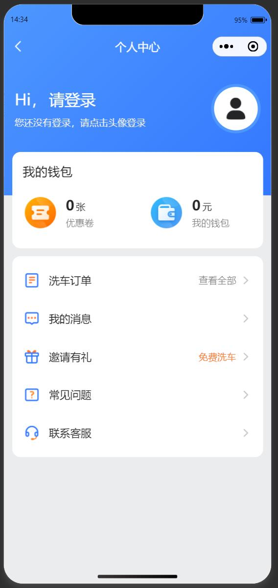
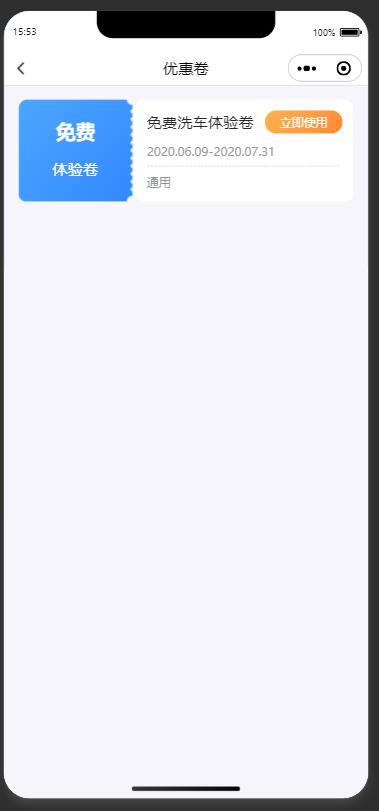

<div align="center">
  <a href="https://github.com/kaivanwong/we-wash-car" target="_blank">
    
  </a>
</div>

<div align="center">
  <h1>weWashCar 自助洗车</h1>
  <div>
  
  基于微信小程序自助洗车页面模板，内嵌地图定位、订单、消息、洗车、个人中心等模块，采用 TypeScript 工程化开发，提供封装的网络请求及相关工具函数。

[](./LICENSE)
[](https://github.com/kaivanwong/we-wash-car)

  </div>
</div>

### ✨ 特性

- 基于微信小程序开发技术，采用 TypeScript 工程化开发，提供封装的网络请求及相关工具函数；

- 提供一套基于完整 UI 设计的静态页面，包含地图、订单、消息、洗车、个人中心等模块；

### 📌 功能页面

- [x] 登录/注册页面、微信登录页面；

- [x] 首页地图、扫码洗车、周围洗车点分布

- [x] 洗车功能页面；

- [x] 个人中心（订单、资料、消息、设置等）；

- [x] 下单、支付、订单、优惠卷等；

### 🌰 界面展示

由于本地静态图片较多，暂时未上线发布，您可以参考图片或者 Clone 代码后运行。

<table>
    <tr>
        <td style="width:33%"></td>
        <td style="width:33%"></td>
        <td style="width:33%"></td>
    </tr>
    <tr>
        <td></td>
        <td></td>
        <td></td>
    </tr>
    <tr>
        <td></td>
        <td></td>
        <td></td>
    </tr>
    <tr>
        <td></td>
        <td></td>
        <td></td>
    </tr>
</table>

### 🌈 使用

#### 1. 初始化

使用微信开发者工具打开，设置您项目的 appId，具体使用方式，可以参考开发文档： [https://developers.weixin.qq.com/miniprogram/dev/framework/](https://developers.weixin.qq.com/miniprogram/dev/framework/)；

配置腾讯地图 Key，存放目录为`/config/map.ts`，您可以访问 [https://lbs.qq.com/](https://lbs.qq.com/) 进行配置；

项目依赖 `wx.getLocation` 接口，请自行申请开通；

#### 2. 目录说明

```
|-- app.json # 页面配置
|-- app.scss # 全局样式
|-- app.ts # 入口文件
|-- sitemap.json # 站点爬虫配置
|-- apis # 接口文件管理
|-- assets # 静态资源
|-- components # 全局组件
|-- config # 配置目录
|-- libs # 插件目录
|-- pages # 页面文件
|-- utils # 工具函数
|-- typings # ts 类型声明
|-- eslintrc.js # eslint 规则
|-- .prettierignore Prettier 格式化忽略文件
|-- .prettierrc.js Prettier 格式化配置
|-- package.json # npm 配置
|-- project.config.json # 项目开发配置
|-- project.private.config.json # 项目开发配置，私有
|-- tsconfig.json # ts 配置
```

### 开源协议

[MIT licensed](./LICENSE) © 2022-PRESENT Kaivan Wong
